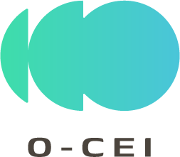

# SEDGE Community

 

A small standalone edition of the **Synthetic Energy Data Generation Engine**.
Newly written Community code and documentation are licensed under **Apache-2.0**.
This is not the proprietary SEDGE Engine and does not change its licence.

## Start here

Requirements: Python 3.11 or later; Node.js 20.19 or later in the 20.x line,
or 22.12 or later; npm; Linux for the supplied background review launcher.
Internet access is needed for the initial dependency installation. Generation
and bundled Help work offline; the optional Swagger interface loads its assets
from a public CDN.

```bash
./scripts/setup.sh
./scripts/start.sh
```

- Web: <http://localhost:5180>
- API and interactive reference: <http://localhost:9010/api/docs>
- Health: <http://localhost:9010/api/v1/healthz>

Select a scenario, adjust the time span and energy settings, and press **Generate
dataset**. The chart, table and metadata describe the same result. CSV includes
every record; JSON includes the configuration and limitations too. No login is
required. Data is held in memory only and is lost when the page is reloaded unless
downloaded.

```bash
./scripts/status.sh
./scripts/stop.sh
```

The launcher binds to loopback, uses ports 5180/9010, and does not install systemd,
Docker, a startup job or a restart policy. Nothing is configured to start after
reboot. The main SEDGE ports 5173/9001, database, outputs and services are untouched.
Conflicting ports cause a clear failure, not termination of another service.

## Included

- Household, rooftop-solar home and small-office scenarios.
- Demand, PV, signed grid exchange and illustrative temperature in UTC.
- Reproducible seeds, 5/15/30/60-minute intervals, 1–31 days, 1–20 buildings.
- Maximum 50,000 rows per request, enforced by both the UI and API.
- CSV/JSON downloads, chart, paginated table, metadata and offline searchable Help.
- A small synchronous FastAPI service and an independently built React interface.

## Intentionally excluded

User management, roles, authentication, recipes, packs, marketplace operations,
databases, queues, ML, training, chaos injection, external weather data,
EnergyPlus, CityLearn, storage/battery simulation, semantic evidence packages,
Kubernetes and persistent deployment. No real data or fitted model is required.

These are illustrative profiles, not a validated physical or forecasting model.
No accuracy, privacy, feasibility or project-KPI performance from the main SEDGE
edition is inherited by this edition.

## Documentation

- [Quick start and controls](docs/help/01-getting-started.md)
- [Method and limitations](docs/help/02-methodology.md)
- [Scenarios and output columns](docs/help/03-scenarios-and-data.md)
- [API usage](docs/help/04-api.md)
- [Troubleshooting](docs/help/05-troubleshooting.md)
- [Development and edition boundaries](docs/DEVELOPMENT.md)
- [Review verification](docs/VERIFICATION.md)
- [Contributing](CONTRIBUTING.md), [support](SUPPORT.md), [changelog](CHANGELOG.md)
- [Publication and release procedure](docs/PUBLISHING.md)
- [Licence](LICENSE), [attribution](NOTICE), [branding](BRANDING.md),
  [dependency notices](THIRD_PARTY_NOTICES.md), [security](SECURITY.md)

Help Markdown is bundled into the Web build: no website or external account is
needed to read it. The API reference is served locally.

## Tests

```bash
.venv/bin/pytest -q
.venv/bin/ruff check backend tests scripts
cd web
npm test
npm run build
```

For an alternative pair of ports:

```bash
./scripts/start.sh --api-port 9011 --web-port 5181
```

The checked-in source has no dependency on a neighbouring SEDGE checkout. No
source or image is published automatically. Generated numerical outputs contain
no third-party input data; XILBI imposes no additional licence restriction on those
values through this edition. Preserve the metadata and limitations when sharing
outputs. Names and logos remain subject to the separate branding terms.

## Ownership and funding

Copyright 2026 Xilbi Sistemas de Informacion SL. Community source and
documentation are Apache-2.0; see [OWNERSHIP.md](OWNERSHIP.md) for the scope and
artwork exceptions. The separate SEDGE Engine is not relicensed.

 

Funded by the European Union through the O-CEI project. Views and opinions
expressed are however those of the author(s) only and do not necessarily
reflect those of the European Union or European Commission. Neither the
European Union nor the granting authority can be held responsible for them.

See [FUNDING.md](FUNDING.md) for programme details and the non-endorsement statement.
